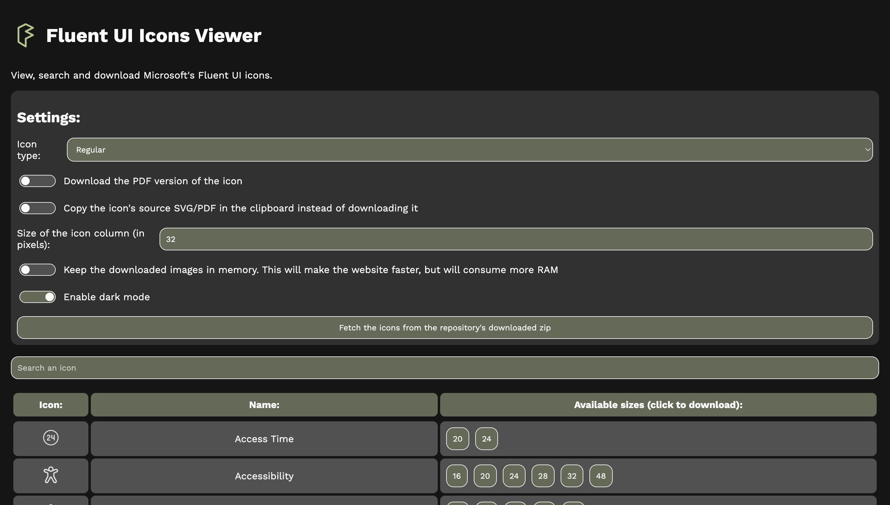

# Fluent Icons Viewer

A simple website to view, search and download Microsoft's Fluent UI icons.

Try it: https://dinoosauro.github.io/fluentui-icons-viewer/

## Usage

Just open the website and scroll until you find the icon you want to download. You'll find in the third column of the row all the available sizes: click on one of them to download the image (or to copy it into the clipboard if you've enabled that option from the Settings).

You can also filter the results by adding some keywords.

## Settings

From the settings, you can:
- Change the icon type (ex: regular icons, filled icons, light icons, colored icons etc.);
- Download the PDF file version instead of the SVG one;
- Copy the image to the clipboard instead of saving it on your device;
- Change the size the icons are displayed in the first column;
- Keep the downloaded images in memory so that the browsing experience can be faster;
- Toggle the dark mode
- Load the icon list locally from a zip file containing Microsoft's Fluent UI repository.